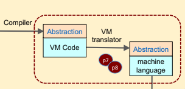

# Building a VM translator 

#### Credit to https://www.nand2tetris.org/course

## Purpose 
A VM translator takes VM code and translates it to machine language for the target hardware. 

I am doing this to study the fundamentals and to challenge myself. 